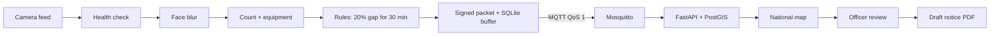

# KushalDrishti (SIH26245) | Team VeriGuard
Privacy-first video audit for training centres. It counts trainees as a number (no identity), checks sanctioned equipment, compares both with the attendance filed on the portal, and sends small signed packets to a national map where an officer decides what happens next.



## Quick start
```bash
python check_files.py                              # all files present?
pip install -r requirements-dev.txt && make test   # 15 tests (cloud tests need PostGIS; CI provides it)
docker compose --profile demo up --build           # cloud + 12 simulated centres -> http://localhost:8000
```
Real models on a video (needs PyTorch, first run downloads the models):
```bash
pip install -r requirements.txt
cd edge && python -m kd_edge.run --video ../classroom.mp4 --centre ITI-DL-001 --claimed 18 --demo --mqtt-host localhost
```
Colab version: `notebooks/KushalDrishti_Colab.ipynb` (same packet format, accepted by the cloud).

## What is built and tested
| Feature | Where | Tested |
|---|---|---|
| Camera health (blocked, dark, blurred, offline never counts as an empty room) | `kd_edge/health.py` | unit + video test |
| Face blur in memory, 480p evidence only on a confirmed breach | `kd_edge/privacy.py`, `pipeline.py` | unit + video test |
| 20% gap held 30 minutes = breach; short breaks ignored | `kd_edge/rules.py` | unit tests |
| Equipment: Present / Absent / Unverified from text names (YOLO-World) | `rules.py`, `detectors.py` | rules tested; model not run in CI |
| Per-centre signing key, hash-chained packets, forged and spoofed packets rejected | `shared/security.py`, `backend/app/ingest.py` | PostgreSQL tests |
| Offline buffer, nothing lost in an outage, chain survives restart | `kd_edge/transport.py` | live broker test, unit test |
| PostGIS map, radius query, silent-centre detection | `backend/app/main.py` | PostgreSQL tests |
| Officer approval, API key, draft notice PDF with SHA-256 | `main.py`, `notice.py` | PostgreSQL tests |

## Demo link for judges (no server needed)
`docs/index.html` is a static map with SIMULATED data (51 centres, one red breach, a side panel, a sample draft notice PDF). Publish it free: GitHub repo > Settings > Pages > Branch `main`, folder `/docs` > Save. Your link: `https://<your-username>.github.io/KushalDrishti/`. Rebuild it with `python tools/build_demo.py`.
Processed video: `python tools/annotate_video.py --video clip.mp4 --out processed.mp4 --claimed 18 --demo`.

## Measured results
Not measured yet. The accuracy table, headcount error and CPU load must come from your own footage: see `docs/EVALUATION.md`. `tools/fill_deck.py` writes them into the deck.

## Honest limits
Detector accuracy has not been measured by this repo. Face blur is best effort. Demo broker settings use no TLS or login. Photos or dummies are not detected (a motion or depth check is an add-on). See `docs/DEPLOYMENT.md`.

## Files
`edge/` centre software | `backend/` cloud | `dashboard/` map page | `shared/` signing | `tools/` deck filler | `docs/` privacy, evaluation, competitors, deployment | `deck/` slides and video pack | `notebooks/` Colab | `tests/`
Licence: AGPL-3.0 (see NOTICE.md for why).
